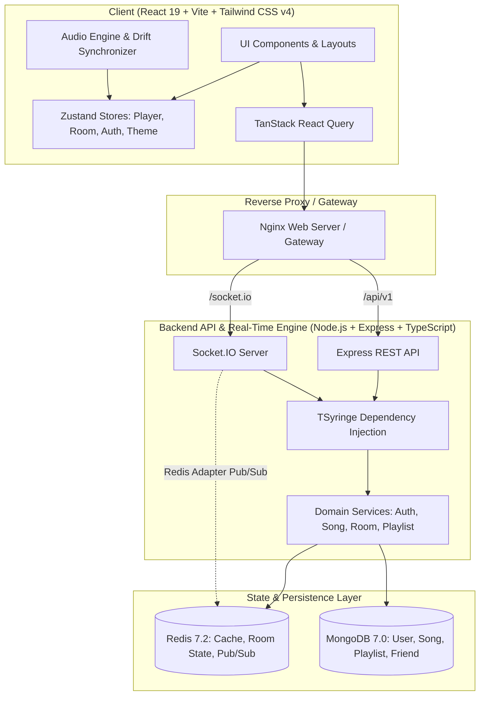

# 🎵 Rhythm — Real-Time Synchronized Music Streaming Web App

> A high-performance, Spotify-inspired music streaming and real-time listening-together platform engineered for scale. Built with sub-second audio synchronization, collaborative rooms, dynamic accent theming, and multi-tier caching.

---

## 🌟 Key Features

### 🎧 Listening Modes
- **Solo Mode**: Explore curated royalty-free tracks, filter by genres, search with live debouncing, manage personal playlists, and save liked songs with instant optimistic updates.
- **Couples Mode**: Synchronized 2-person intimate listening sessions. Both listeners share equal control over playback, seeking, and track selection.
- **Party Mode**: Group listening sessions supporting up to 50 concurrent listeners with host-managed permissions (`host_only` vs. `anyone`), real-time collaborative queue management, and live floating emoji reactions.

### ⏱️ Sub-Second Audio Synchronization Engine
- **Lead-Buffer Scheduled Playback**: When playback or track changes are triggered, the server computes a synchronized `scheduledAt` timestamp with a 250ms propagation lead buffer.
- **Clock Calibration**: Socket ping/pong (`SYNC:PING` / `SYNC:PONG`) periodically calculates server-client clock offset and network roundtrip latency.
- **Dynamic Drift Correction**: Background drift monitors detect discrepancies exceeding 200ms and gently realign client playback timelines.
- **Independent Listener Volume**: Each participant sets their own personal listening volume without altering others' audio levels.

### 🎨 5 Dynamic Spotify-Style Accent Themes
- Spotify near-black glassmorphic aesthetic (`#09090b` base).
- Switch between **Green (Spotify Classic)**, **Blue (Electric)**, **Purple (Neon)**, **Pink (Cyberpunk)**, and **Orange (Sunset)** with zero-reload CSS variable tokens synced to MongoDB user preferences.

---

## 🏗️ System Architecture



---

## 🛠️ Technology Stack

| Layer | Technologies |
| :--- | :--- |
| **Frontend** | React 19, TypeScript, Vite, Tailwind CSS v4, Zustand, TanStack Query, React Router v7, Lucide React, Axios |
| **Backend** | Node.js, Express, TypeScript (Strict), Socket.IO, TSyringe (DI), Zod, Pino Logger, Helmet, Cors, Bcrypt |
| **Database & Cache** | MongoDB (Mongoose with Compound Indexes), Redis 7.2 (ioredis with Redis Socket.IO adapter) |
| **DevOps & Testing** | Docker, Docker Compose, Multi-stage builds, Nginx, Vitest |

---

## 🚀 Quickstart Guide (Local Development)

### 1. Prerequisites
- [Node.js](https://nodejs.org/) (v20+ recommended)
- [MongoDB](https://www.mongodb.com/) (running locally on port `27017` or via Docker)
- [Redis](https://redis.io/) (running locally on port `6379` or via Docker)

### 2. Start Supporting Services (Optional via Docker)
```bash
docker run -d --name rhythm-mongo -p 27017:27017 mongo:7.0
docker run -d --name rhythm-redis -p 6379:6379 redis:7.2-alpine
```

### 3. Backend Setup
```bash
cd server
npm install

# Seed sample royalty-free tracks
npm run seed

# Run unit tests
npm test

# Start backend dev server (port 5000)
npm run dev
```

### 4. Frontend Setup
```bash
cd ../client
npm install

# Start Vite dev server (port 5173)
npm run dev
```

Open your browser at `http://localhost:5173` to explore Rhythm!

---

## 🐳 Production Deployment with Docker Compose

Deploy the complete multi-tier stack (MongoDB, Redis, Node API, and Nginx Web Client) with a single command:

```bash
docker compose up --build -d
```

- **Frontend Application**: `http://localhost` (Port 80)
- **Backend API**: `http://localhost:5000/api/v1`
- **Health Check**: `http://localhost:5000/api/v1/health`

To stop the containers:
```bash
docker compose down
```

---

## 📡 API & Socket Event Reference

### REST Endpoints
- **Authentication**: `POST /api/v1/auth/register`, `POST /api/v1/auth/login`, `POST /api/v1/auth/refresh`, `POST /api/v1/auth/logout`
- **User Profile & Theme**: `GET /api/v1/users/me`, `PATCH /api/v1/users/theme`
- **Songs & Search**: `GET /api/v1/songs?q=&genre=&sort=`, `GET /api/v1/songs/trending`, `POST /api/v1/songs/:id/play`
- **Playlists**: `GET /api/v1/playlists`, `POST /api/v1/playlists`, `PATCH /api/v1/playlists/:id`, `POST /api/v1/playlists/:id/tracks`
- **Favorites**: `GET /api/v1/favorites`, `POST /api/v1/favorites/:songId`, `DELETE /api/v1/favorites/:songId`
- **Rooms**: `POST /api/v1/rooms`, `GET /api/v1/rooms/:code`, `POST /api/v1/rooms/:code/join`
- **Friends**: `GET /api/v1/friends`, `POST /api/v1/friends/request/:id`, `PATCH /api/v1/friends/accept/:id`

### Socket.IO Events
- **Time Synchronization**: `SYNC:PING` ⇄ `SYNC:PONG` (Calculates client-server clock offset)
- **Room Lifecycle**: `ROOM:JOIN`, `ROOM:JOINED`, `ROOM:LEAVE`, `ROOM:MEMBER_JOINED`, `ROOM:MEMBER_LEFT`, `ROOM:HOST_CHANGED`
- **Playback Control**: `PLAYBACK:PLAY`, `PLAYBACK:PAUSE`, `PLAYBACK:SEEK`, `PLAYBACK:CHANGE_SONG`, `PLAYBACK:STATE`
- **Queue & Reactions**: `QUEUE:ADD`, `QUEUE:REMOVE`, `QUEUE:UPDATED`, `ROOM:REACTION`

---

## 🛡️ Security & Performance Highlights
- **JWT Refresh Rotation**: Ephemeral 15-minute access tokens with 7-day refresh tokens rotated in `httpOnly` secure cookies.
- **JTI Blocklisting**: Instant logout revocation cached in Redis.
- **Buffered Analytics**: Play counts buffered in Redis and periodically flushed to MongoDB via `PlayCountFlusher`.
- **Authoritative Playback State**: Atomic versioned state in Redis prevents split-brain playback sync desynchronization.
